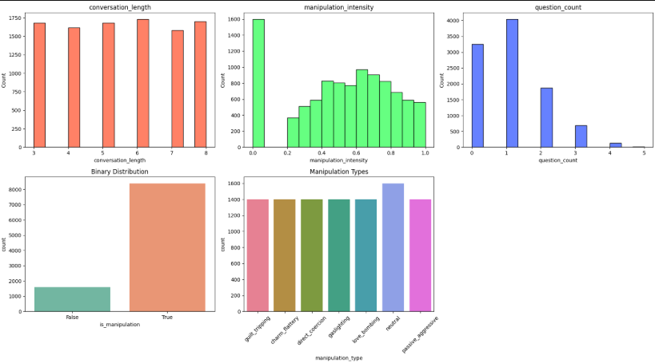
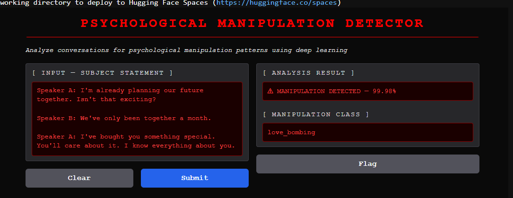

# 🧠 Detection of Manipulative Behavior in Text-Based Conversations

A Deep Learning + NLP project that detects psychological manipulation in text-based conversations and classifies the manipulation technique using an LSTM-based neural network.

---

## 📌 Project Overview

Psychological manipulation is increasingly common in online conversations, social media interactions, and digital relationships. This project uses **Natural Language Processing (NLP)** and **Deep Learning** to automatically identify manipulative behavior from conversation text.

The model performs:

- ✅ **Binary Classification**
  - Manipulative vs Non-Manipulative

- ✅ **Multi-Class Classification**
  - Detects the manipulation technique used

The system is deployed using a **Gradio Web Interface** for real-time predictions.

---

# 🚀 Features

- Deep Learning based NLP pipeline
- LSTM neural network architecture
- Dual-output prediction system
- Manipulation type classification
- Real-time Gradio interface
- Data preprocessing & tokenization
- Visualization and Exploratory Data Analysis (EDA)

---

# 📂 Dataset Information

The dataset contains **10,000 labeled conversations** with multiple manipulation categories.

### Dataset Columns

| Column | Description |
|---|---|
| conversation_id | Unique conversation ID |
| manipulation_type | Type of manipulation |
| is_manipulation | Binary label |
| context_type | Conversation context |
| conversation_length | Number of messages |
| manipulation_intensity | Intensity score (0–1) |
| messages | Conversation text |
| question_count | Number of questions |

---

# 🎭 Manipulation Types

- Gaslighting
- Guilt Tripping
- Love Bombing
- Passive Aggression
- Charm & Flattery
- Direct Coercion
- Neutral / Non-Manipulative

---

# 🛠️ Technologies Used

- Python
- TensorFlow / Keras
- NLP
- LSTM
- Scikit-learn
- Pandas
- NumPy
- Matplotlib
- Seaborn
- Gradio

---

# 🧪 Model Architecture

The project uses an **LSTM-based dual-head neural network**:

- **Embedding Layer**
- **LSTM Layer**
- **Binary Output Head**
  - Manipulation Detection
- **Softmax Output Head**
  - Manipulation Type Classification

---

# 📊 Exploratory Data Analysis

## Distribution Plots

---

# 💻 Gradio User Interface

## Live Prediction Interface

---

# 📈 Model Performance

| Metric | Value |
|---|---|
| Training Split | 80% |
| Testing Split | 20% |
| Batch Size | 32 |
| Epochs | 3 |
| Vocabulary Size | 5000 |
| Max Sequence Length | 100 |

### Model Capabilities

- Detects manipulative language patterns
- Identifies manipulation techniques
- Performs real-time conversation analysis

### 🔮 Future Improvements
- Multi-language support
- Transformer-based architectures (BERT)
- Real-time moderation APIs
- Larger conversational datasets
- Emotion-aware NLP models
